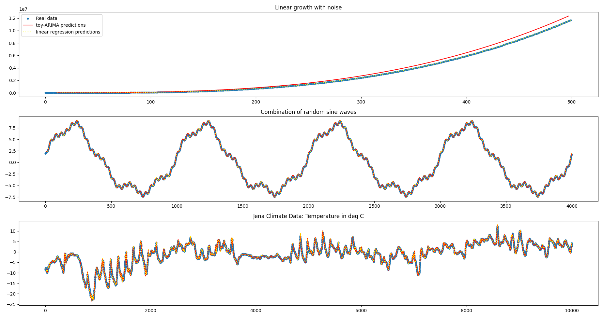

# ARIMA

The code here implements a quick-and-dirty version of the _philosophy behind ARIMA_.
Basically, for a rolling window, the pipeline
- differences the data until it seems kind of flat
- performs a linear regression on the differenced data to extend, and
- dedifferences the data to make the predictions.

This performs remarkably well, although even simple linear-regressions over sliding windows perform even better.

However, this is a good starting point to figure out what actually happens behind the curtains in things like ARIMA.
