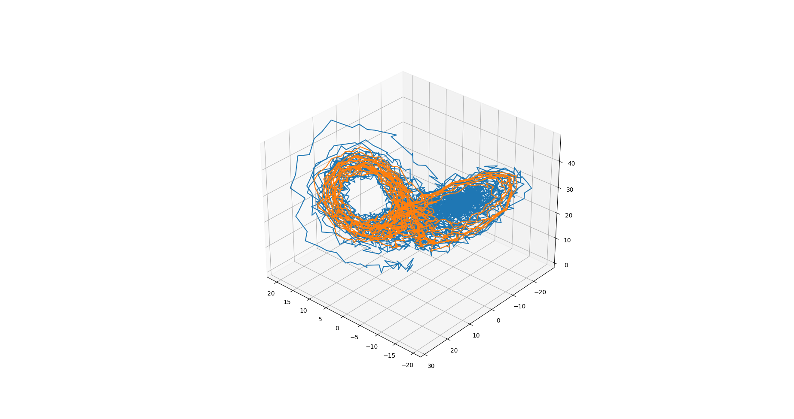
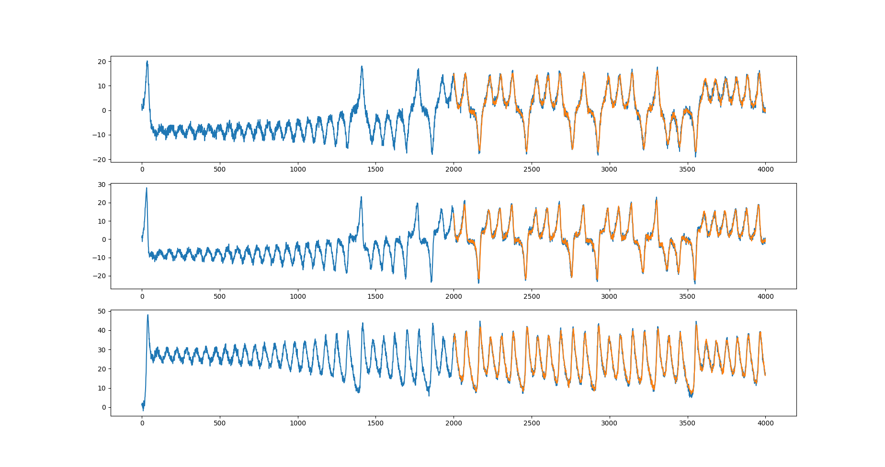
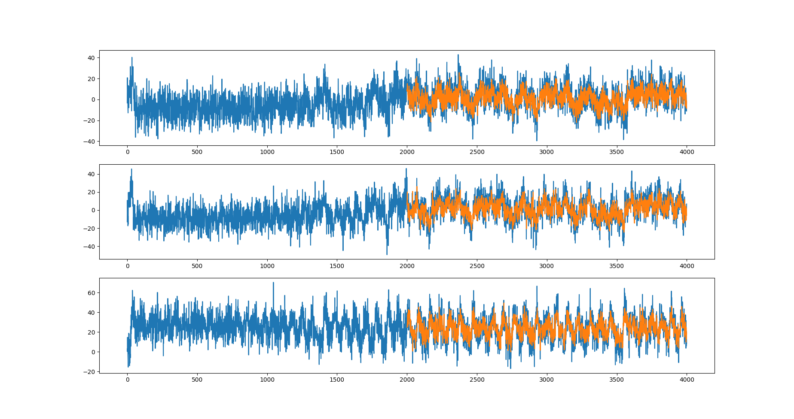

# Dynamic approaches to forecasting

This is a to implementation of the _philosophy behind_ things like S-MAP and Simplex Projection.
These methods are equivalent to [k-Nearest-Neighbours prediction](https://en.wikipedia.org/wiki/K-nearest_neighbors_algorithm),
with minor modifications in each case.

We simulated the [Lorenz system](https://en.wikipedia.org/wiki/Lorenz_system), a popular example of chaotic dynamics, and
the [Lotka-Volterra equations](https://en.wikipedia.org/wiki/Lotka-Volterra_equations) for predator-prey dynamics.
With sufficient time-series data, the model performed really well, fitting really well to the series.
It did not seem extremely susceptible to noise.

The dynamic forecast of the Lorenz equations are very impressive

With low noise, the dynamics are predicted quite well

whereas, if the noise is increased, the predictive power does not go down as badly as expected

