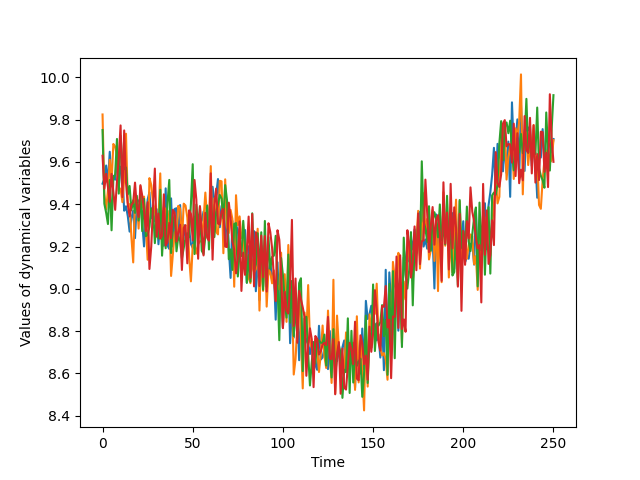

# Granger Causality and Transfer Entropy

Both these messages seem to be doing quite poorly with simulated data.
I accidentally deleted the data from simulated ODEs, but the methods failed to pick up connections there.
They also failed in the current case, where all variables $x_t$ are linear combinations of previous variables with added noise.



These equations, which you can find in `dynamics.py`, have very simple rules by which the Granger-Causality and Transfer Entropy metrics
must catch the rules of influence easily. 
However, what we find is that the Granger method says the following about lag-1 and lag-2
```
First day results:
[[0. 1. 1. 1.]
 [1. 0. 1. 1.]
 [1. 1. 0. 1.]
 [1. 1. 1. 0.]]
Second day results:
[[0. 0. 1. 0.]
 [1. 0. 1. 1.]
 [1. 1. 0. 1.]
 [1. 1. 1. 0.]]
```

Similarly, transfer entropy also fails to identify the correct pattern of influence

```
Transfer entropies:
          0         1         2         3
0  0.000000  0.020863  0.026846  0.069797
1  0.014448  0.000000  0.024312  0.049316
2  0.017541  0.035468  0.000000  0.021437
3  0.006668  0.021425  0.032677  0.000000
```

If there is something we are missing, please don't hesitate to contact us and let us know.
